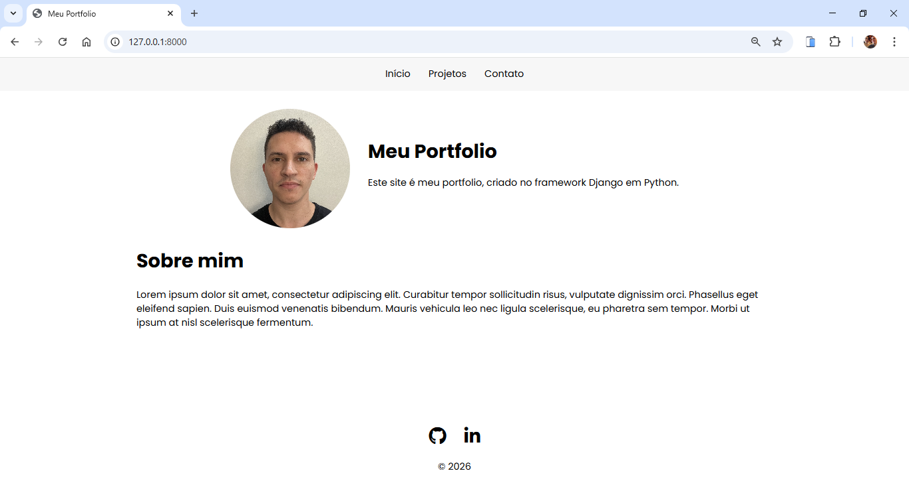
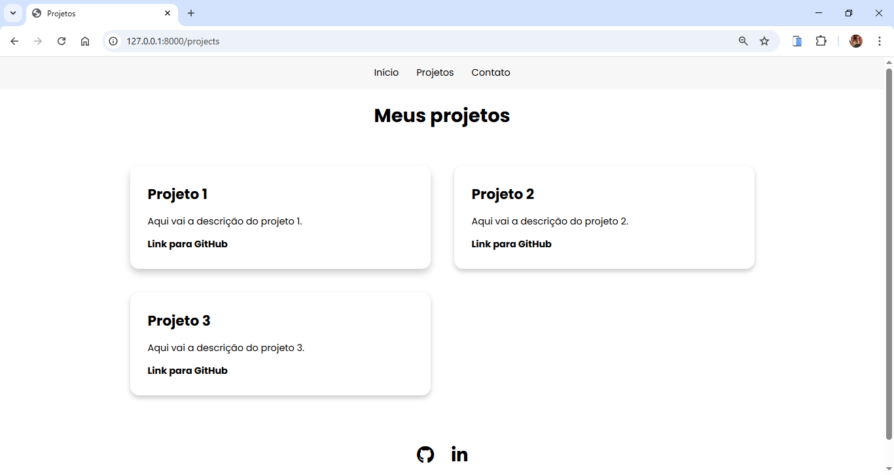
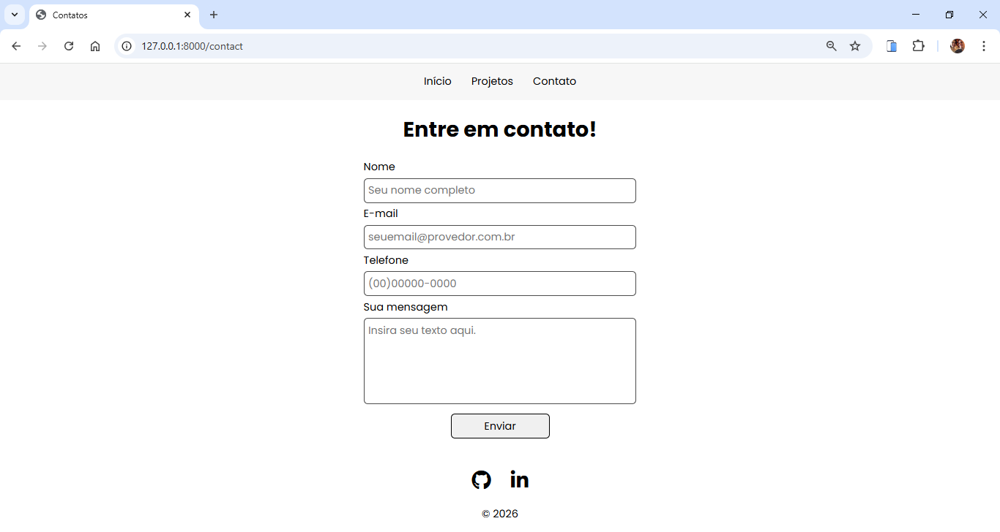

# Projeto Django - Exercício de Estudo

Este projeto foi desenvolvido como exercício prático utilizando:

- Python
- Django
- HTML
- CSS

## 🎯 Objetivo
Criar um site simples utilizando Django para reforçar conceitos de:
- Rotas
- Views
- Templates
- Estrutura MVC

## 🚀 Como rodar o projeto

1. Clone o repositório:
```git clone https://github.com/lucasfgarcez/django-exercicio-portfolio.git```

2. Crie um ambiente virtual:
```python -m venv venv```

3. Ative o ambiente:
```venv\Scripts\activate  (Windows)```

4. Instale as dependências:
```pip install -r requirements.txt```

5. Rode o servidor:
```python manage.py runserver```

## 📸 Páginas do Projeto

### 🏠 Página Inicial


### 📄 Página Projetos


### 📞 Página Contato

